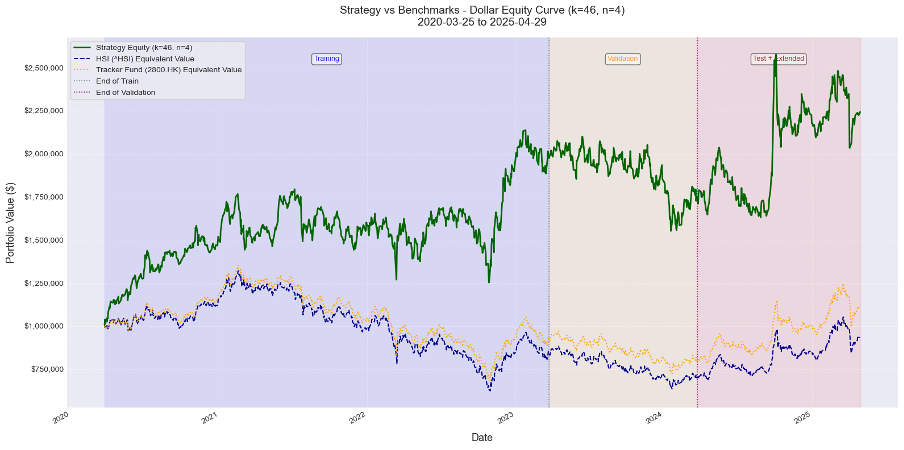

# Quantitative Trading Models Using Deep Learning (EMIA-03)

> ## 📌 Project Status & Future Direction
>
> **The official EMIA 4991 capstone project is now complete.** The code in this repository utilizing the open source llama model represents the final, successful submission from the original team.
>
> Moving forward, this repository will serve as a platform for my (**TO, Cheuk Man**) personal exploration and enhancement of this work. I will be building upon the team's established three-stage framework to push the boundaries of the strategy's performance.
>
> **My current focus is integrating a more powerful, state-of-the-art LLM: `gemma3:27b`.**
>
> **Status of New Development:** 🚧 Under Development

---

This repository contains the source code for the "Quantitative Trading Models Using Deep Learning" project, completed as part of the EMIA 4991 Interdisciplinary Capstone Project at The Hong Kong University of Science and Technology.

The project introduces a novel, three-stage framework that integrates Large Language Models (LLMs) for alpha factor discovery, a multi-agent system for multi-modal factor selection, and a Deep Neural Network (DNN) for dynamic portfolio optimization in the Hong Kong stock market.

---

## 🌟 Performance Highlights & Key Results

The strategy demonstrated exceptional risk-adjusted returns, significantly outperforming market benchmarks over a ~5-year period that included both bull and bear market phases.

### Strategy Equity Curve (Extended Period: 2020-2025)
The plot below visualizes the final selected strategy's cumulative return (log scale) against the Hang Seng Index (^HSI) and the Tracker Fund (2800.HK). The strategy (blue line) generated a **+92.79%** return, nearly doubling the initial capital, while the benchmarks stagnated or declined.

  

### Detailed Performance Metrics
The strategy's superiority is evident across most key metrics when compared to passive investment in benchmarks over the full backtest period.

| Metric | Strategy (k=56, n=4) | HSI Benchmark | Tracker Fund (2800.HK) | Comparison |
| :--- | :---: | :---: | :---: | :---: |
| **Cumulative Return** | **`+92.79%`** | `-6.61%` | `+10.99%` | ✅ **Superior** |
| **Annualized Return** | **`14.14%`** | `-1.37%` | `2.12%` | ✅ **Superior** |
| **Sharpe Ratio** | **`0.582`** | `0.073` | `0.210` | ✅ **Superior** |
| **Sortino Ratio** | **`0.882`** | `0.108` | `0.308` | ✅ **Superior** |
| **Max Drawdown** | `-36.61%` | `-52.75%` | `-49.39%` | ✅ **Superior** |
| **Recovery Time (Days)** | `374` | `N/A` | `N/A` | ✅ **Superior** |
| **Annualized Volatility**| `30.95%` | `25.45%` | `25.14%` | ❌ **Higher** |

*The higher volatility is a trade-off for substantially higher returns and better risk management during downturns (shallower drawdown and faster recovery).*

---

## 🔬 Parameter Tuning & Model Robustness

The final strategy is not a single, arbitrary result but the outcome of a rigorous grid search over thousands of parameter combinations. The goal was to find a **balanced and robust** configuration, not just one that overfit to a single metric on the validation set.

Our chosen parameters (`k=56, n=4`) were selected for providing the best-balanced performance across return, Sharpe ratio, and drawdown. The chart below shows the performance of other top-performing candidates. While some (`k=46, n=4`) achieved higher raw returns, they came with deeper drawdowns. This confirms our selection process successfully prioritized risk-adjusted performance.

  
  <em>(Performance of alternative high-performing candidates from the validation grid search)</em>

---

## 🔧 Framework Overview

The project's success is rooted in its unique three-stage methodology, designed to systematically discover, filter, and optimize trading signals.

  

### Stage 1: Seed Alpha Factory (Generation)
An automated pipeline retrieves academic papers from arXiv. A multi-modal RAG agent (`LlamaIndex`, `Ollama`) processes the text and visual content to generate an initial pool of 15 promising alpha factors.

  

#### The Challenge of Raw Alpha Factors
Most individual factors generated in Stage 1 are inherently noisy and do not consistently outperform the market on their own, as shown below. This noise highlights the critical need for the subsequent selection and optimization stages.

  
  
  
  <em>(Some individual factors often underperform, necessitating intelligent combination)</em>

### Stage 2: Multi-Agent Multi-Modal Selection (Filtering)
Specialist agents analyze diverse data for each stock. A coordinating `MarketDebateAgent` prompts an LLM to select the most relevant factors from the initial pool. After aggregating selections across all 83 stocks, the **top 6 most frequently validated factors** were chosen for optimization:
*   `ATR_14d` (Volatility)
*   `MA_Crossover_10_50` (Trend)
*   `Normalized_BBW_20d_2std` (Volatility)
*   `Stochastic_Oscillator_14d` (Momentum)
*   `Volume_Momentum_50d` (Volume/Momentum)
*   `Mean_Reversion_20d` (Mean Reversion)

### Stage 3: Optimal Strategy Weighting & Validation (Optimization)
A `TensorFlow/Keras` MLP model is trained on the 6 selected factors to predict future returns. The model weights are optimized to maximize the Sharpe ratio and rigorously backtested.

---

## 💻 Technology Stack

*   **Machine Learning / AI:** TensorFlow/Keras, Scikit-learn, Pandas, NumPy
*   **Large Language Models:** Ollama (running open source llama model for the completed project, **upgrading to `gemma3:27b`**)
*   **Frameworks:** LlamaIndex
*   **Data Acquisition & Processing:** yfinance, requests, PyPDF2, NLTK
*   **Backend & Simulation:** Python 3.12, Jupyter Notebooks
*   **Frontend User Interface:** Next.js, Tailwind CSS

---

## 📉 Limitations & Future Work

While the project was successful, we identified several areas for improvement:
*   **Limitations:** Market regime sensitivity, data quality constraints, high computational costs, and idealized simulation (no transaction costs/slippage).
*   **Future Work:**
    1.  **Adaptive Parameter Tuning:** Implement reinforcement learning or Bayesian optimization.
    2.  **Enhanced Data Pipelines:** Integrate real-time data sources (social media, earnings calls).
    3.  **Hybrid Models:** Combine DNN signals with traditional econometric models (e.g., GARCH).
    4.  **Advanced Risk Management:** Implement portfolio-level stop-loss mechanisms.
    5.  **Continuous Factor Monitoring:** Periodically re-evaluate the predictive power of alpha factors.

---

## 👥 Original Project Contributors
This project was a collaborative effort by the following team members:
*   **CHAN, Shing Chung**
*   **LAI, Chi Shing**
*   **TO, Cheuk Man**
*   **YIU, Calvin**

*Future development of this repository is maintained solely by **TO, Cheuk Man** ([alanto0923](https://github.com/alanto0923)).*

## 🙏 Acknowledgments
We would like to thank **The Hong Kong University of Science and Technology** for the opportunity to undertake this Interdisciplinary Capstone Project (EMIA 4991).

## 📄 License
This project is licensed under the [MIT License](LICENSE.md).
